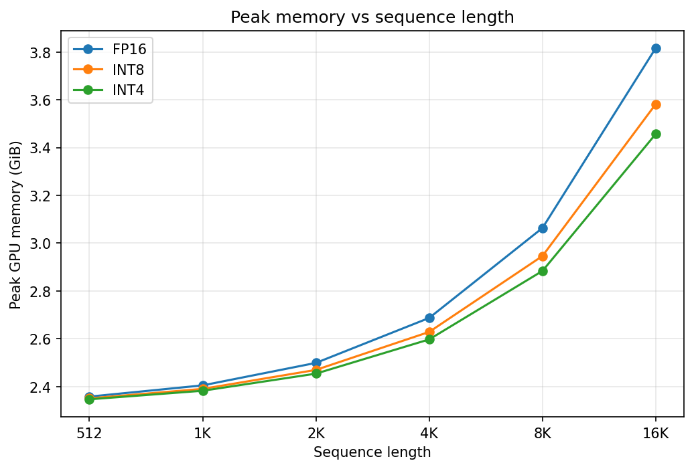
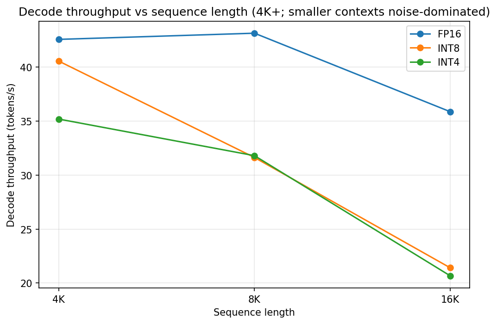
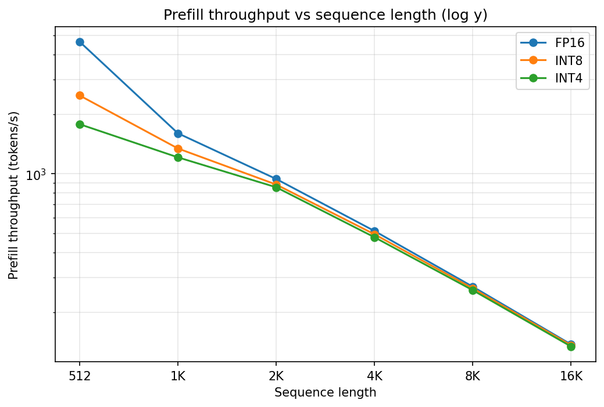

# KV Cache Quantization Benchmark on Llama 3.2-1B

Measuring GPU memory, throughput, and quality tradeoffs of FP16 / INT8 / INT4 KV cache on a small Llama model and a single T4 GPU (16GB).

## Headline

| Variant | Peak memory @ 16K | Decode tok/s @ 16K | Prefill tok/s @ 512 | Perplexity (wikitext-2) |
|---|---|---|---|---|
| FP16 | 3.82 GiB | 35.9 | 4647 | 8.59          |
| INT8 | 3.58 GiB | 21.4 | 2487 | 8.59 (+0.03%) |
| INT4 | 3.46 GiB | 20.7 | 1781 | 9.04 (+5.3%)  |

At 16K context, INT4 saves 360 MiB of GPU memory vs FP16, around half the FP16 cache. Decode at long context drops ~40% for both INT8 and INT4 (dequantization cost). Prefill at short context pays a one-time HQQ optimization cost (more for INT4); amortized at 8K+.

## Motivation

KV cache memory grows linearly with sequence length. For Llama 3.2-1B, the cache crosses the model weight size (~2.47 GB) at ~75K tokens. Past that point, the cache, not the weights, sets the memory ceiling. On a 16 GB T4, FP16 cache hits that ceiling near 32K tokens.

Quantizing K and V stored in the cache reduces bytes-per-element. INT8 = ~half the FP16 size, INT4 = ~a quarter (with metadata adjustments [docs/theory.md](docs/theory.md)). Same hardware, longer context.

Prior work (KIVI, KVQuant) has shown that aggressive cache quantization is feasible with minimal quality loss when K and V are handled asymmetrically. This project takes a simpler approach, uniform quantization via HQQ and measures the cost.

## Methodology

### Setup
- **Model**: `meta-llama/Llama-3.2-1B` (16 layers, GQA with 32 attention heads / 8 KV heads, head_dim=64).
- **Hardware**: single NVIDIA T4 (16 GB VRAM) on Google Colab.
- **Weights**: FP16. Only the *KV cache* is quantized.
- **Attention**: `attn_implementation="flex_attention"`. FlexAttention uses torch.compile to not store the full T*T tensor.

### What's measured
- **Peak GPU memory**: `torch.cuda.max_memory_allocated()` after a single prefill.
- **Prefill tok/s**: `seq_len / median time taken for prefill` over 10 runs (3 warmup).
- **Decode tok/s**: `1 / median per-step time`.
- **Perplexity**: `wikitext-2 test`, sliding window.

Timing uses `time.perf_counter()` with `torch.cuda.synchronize()` before and after each call. Median over 10 runs to reduce shared-GPU jitter.

### Quantization config (HQQ)
- Backend: `transformers.QuantizedCache(backend="hqq", ...)`.
- `nbits ∈ {8, 4}`, `q_group_size=64`, `residual_length=64`, `axis_key=axis_value=0`.

Identical config across INT8 and INT4. The only change is `nbits`. Quality differences are attributable to bit width alone. See [docs/theory.md](docs/theory.md) for the affine-quantization derivation, metadata-overhead math (INT4 with group=64 = ~3.56x compression, not 4x), and error-variance discussion.


## Results

### Memory



- INT4 peak memory at 16K is 368 MiB lower than FP16. This is consistent with the 3.56x cache compression predicted in theory.md. 
- FP16 cache size is measured directly (512 MiB, observed equals theoretical at every cell). 
- For INT4, the cache is not measured directly. Its size is inferred from the peak-memory delta (since model weights and FlexAttention overhead are constant across variants), giving an implied INT4 cache of 144 MiB. Theory predicts 144 MiB exactly.

### Decode throughput



(Plot starts at 4K; smaller seq_lens are timing-noise dominated on T4 with n_runs=10.)

- INT8 and INT4 are nearly indistinguishable above 4K.
- HQQ's dequant kernel is fast enough that bit width doesn't change decode throughput. 
- Both pay ~30-40% latency vs FP16 at 16K (36 → 21 tok/s). 
- The longer the cache, the more K/V to dequantize per attention step.

### Prefill throughput



- Log-y axis to span the 35x range. The slope = ~−1 in log-log space confirms attention's O(N²) prefill cost (tok/s ∝ 1/N).
- INT4 pays a noticeable prefill cost at small context (~62% slower than FP16 at 512 tokens).
- HQQ's INT4 optimization does iterative refinement per group, more expensive per call than INT8
- By 8K+ the cost amortizes. All three variants converge.

### Quality (perplexity)

- FP16 baseline is **8.59** on wikitext-2 test. 
- INT8 (**8.59**) is essentially free. +0.0027 perplexity (+0.03%) for 1.94x cache compression. 
- INT4 (**9.04**) pays a real but bounded cost of +0.45 perplexity (+5.3%) for 3.56x compression. That's the  tradeoff.

For comparison: KIVI (2024) reports a *2-bit* asymmetric scheme stays within ~0.1–0.3 perplexity of FP16 on Llama-2 which is tighter than our naive 4-bit, despite using fewer bits. The gap reflects KIVI's asymmetric K/V handling (per-channel K + per-token V), specifically designed around the "K has outliers, V is well-behaved" finding. Uniform HQQ-INT4 doesn't capture that structure.

## Reproducibility

```bash
# Llama 3.2 is gated — accept the license, then `hf auth login`
pip install -r requirements.txt

# Edit __main__ in run_benchmark.py to switch variant ('fp16' / 'int8' / 'int4')
python -m scripts.run_benchmark              # resutls get stored in results/benchmark_<variant>.json

python -m scripts.run_perplexity             # results get stored in results/perplexity.json
python -m scripts.plot_results               # plots get stored in results/plots/*.png
```

Tested on Colab using T4 GPU (16 GB VRAN). Per-variant benchmark sweep ~20 min; perplexity ~45 min; plots are local.

## Future work

- **Asymmetric K/V** (KIVI-style: per-channel K, per-token V)
- **Weight quantization** (orthogonal axis: load-time cost, not runtime). Mature via bitsandbytes / AWQ / GPTQ
- **A100 / H100 numbers** T4 prefill is bottlenecked by SM 7.5 attention. modern GPUs change the latency tradeoff.

## References

- [KIVI: A Tuning-Free Asymmetric 2bit Quantization for KV Cache (Liu et al., 2024)](https://arxiv.org/pdf/2402.02750)
- [KVQuant: Towards 10 Million Context Length LLM Inference with KV Cache Quantization (Hooper et al., 2024)](https://arxiv.org/pdf/2401.18079)
- [GEAR: An Efficient KV Cache Compression Recipe (Kang et al., 2024)](https://arxiv.org/pdf/2403.05527)
- [HQQ: Half-Quadratic Quantization for Large Language Models (Badri & Shaji, Mobius Labs)](https://dropbox.github.io/hqq_blog/)

## License
MIT, see [LICENSE](LICENSE)